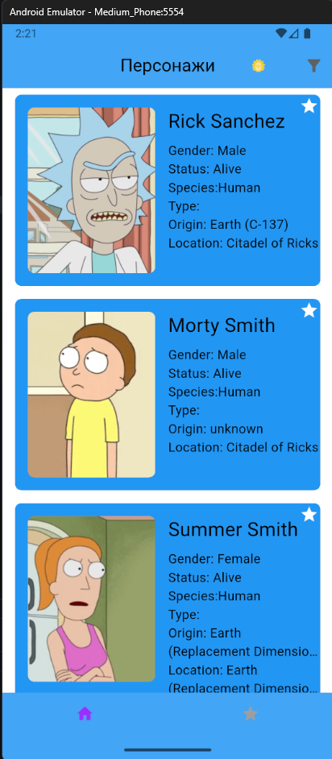
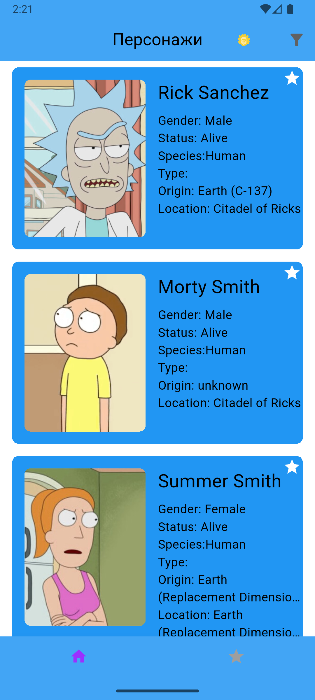
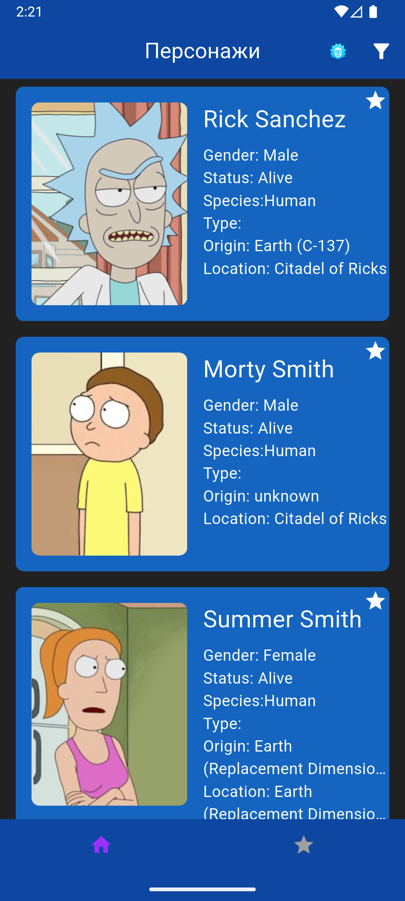
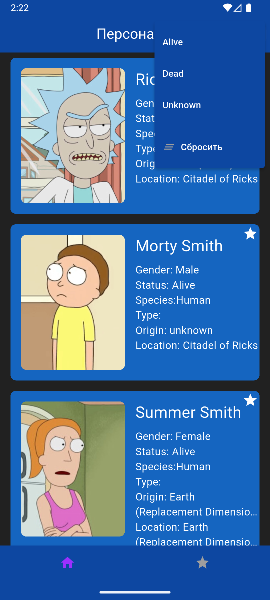
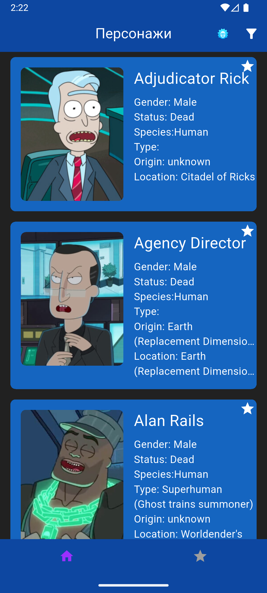
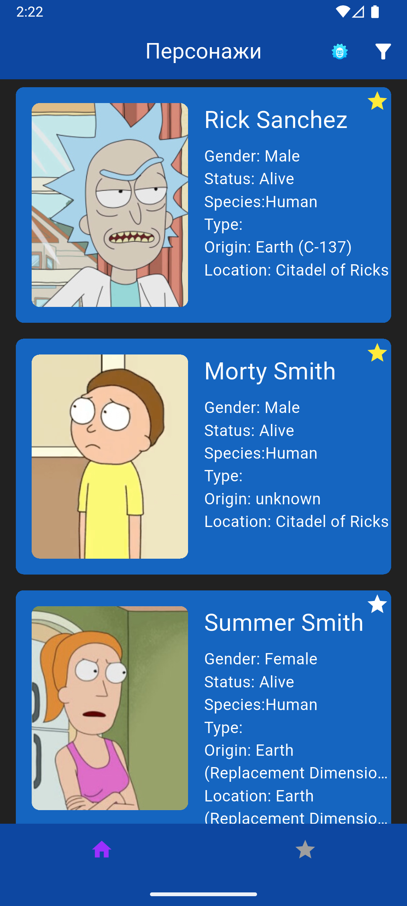
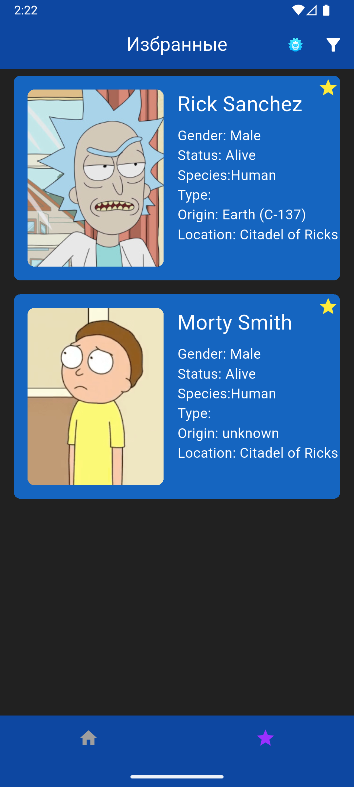
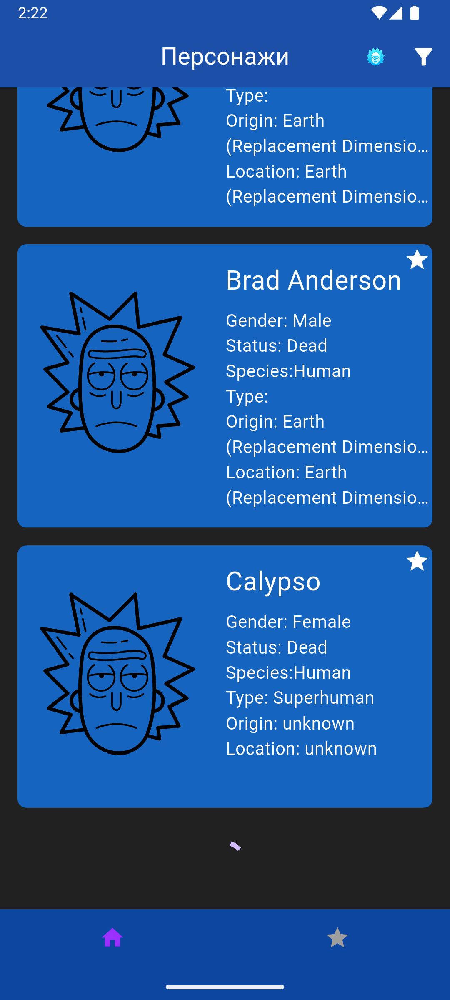

# Rick and Morty App

Мобильное приложение, разработанное на Flutter для просмотра персонажей из сериала *Rick and Morty*.

Проект разработан с использованием следующих технологий:

- **[Flutter](https://flutter.dev/)** — основной фреймворк для кроссплатформенной разработки мобильных приложений.
- **[Dio](https://pub.dev/packages/dio)** — HTTP клиент для выполнения запросов к API.
- **[flutter_bloc](https://pub.dev/packages/flutter_bloc)** — управление состоянием с использованием паттерна BLoC.
- **[json_annotation](https://pub.dev/packages/json_annotation)** — аннотации для генерации JSON сериализации.
- **[json_serializable](https://pub.dev/packages/json_serializable)** — генерация сериализаторов/десериализаторов JSON.
- **[build_runner](https://pub.dev/packages/build_runner)** — генерация кода на этапе сборки.
- **[freezed](https://pub.dev/packages/freezed)** — для удобного создания immutable классов и union типов.
- **[flutter_screenutil](https://pub.dev/packages/flutter_screenutil)** — адаптация интерфейса под разные размеры экранов.
- **[get_it](https://pub.dev/packages/get_it)** — сервис-локатор для управления зависимостями.
- **[flutter_switch](https://pub.dev/packages/flutter_switch)** — кастомный виджет переключателя.
- **[hive_ce](https://pub.dev/packages/hive_ce)** и **hive_ce_flutter** — легковесная база данных для хранения локальных данных.
- **[flutter_svg](https://pub.dev/packages/flutter_svg)** — работа с SVG графикой.
- **[cached_network_image](https://pub.dev/packages/cached_network_image)** — кэширование изображений из сети.
- **[flutter_native_splash](https://pub.dev/packages/flutter_native_splash)** — настройка нативного сплэш-экрана.
- **[flutter_gen](https://pub.dev/packages/flutter_gen_runner)** — генерация ресурсов проекта.

---

## Установка и сборка

1. Клонируй репозиторий:
git clone https://github.com/Vasilii999/Github-users-app
cd rick_and_morty
2. Установи зависимости:
   flutter pub get
3. Сгенерируй код (если используются json_serializable или freezed):
   flutter pub run build_runner build --delete-conflicting-outputs
4. Запусти приложение на эмуляторе или подключенном устройстве:
   flutter run

